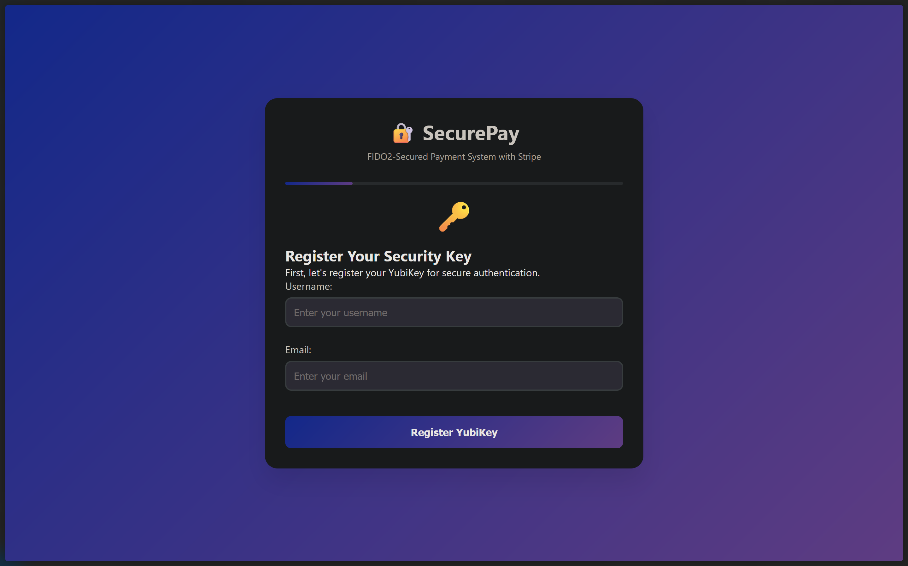

# SecurePay: FIDO2 + Stripe Payment System

SecurePay is a secure payment system that combines FIDO2/WebAuthn authentication (e.g., YubiKey) with Stripe payment processing. Users register a security key, authenticate with it, and then make payments via credit card or bank transfer, all in a seamless web interface.

This project was just made for learning purposes and does not represent a fully functional model of the payment system yet, more versions to be updated.

## Features

- **FIDO2/WebAuthn Authentication:** Register and authenticate users with hardware security keys (like YubiKey).
- **Stripe Integration:** Accept payments via credit card or US bank account (ACH).
- **Modern UI:** Responsive, single-page frontend with step-by-step payment flow.
- **In-memory Storage:** For demo purposes; swap with a real database for production.
- **API Endpoints:** RESTful backend for registration, authentication, payments, and admin queries.

## Demo



 
 

 

## Getting Started

### Prerequisites

- [Node.js](https://nodejs.org/) v16 or higher
- [Stripe Account](https://dashboard.stripe.com/register) (for API keys)
- A FIDO2-compatible security key (e.g., YubiKey) for full functionality

### Installation

1. **Clone the repository:**
   ```sh
   git clone https://github.com/iprajwalsingh7/fido2-stripe-payment.git
   cd fido2-stripe-payment
   ```

2. **Install dependencies:**
   ```sh
   npm install
   ```

3. **Configure environment variables:**
   - Set your Stripe API keys and webhook secret in `.env`:
     ```
     STRIPE_PUBLISHABLE_KEY=your_publishable_key
     STRIPE_SECRET_KEY=your_secret_key
     STRIPE_WEBHOOK_SECRET=your_webhook_secret
     PORT=3000
     NODE_ENV=development
     JWT_SECRET=your_jwt_secret
     SESSION_SECRET=your_session_secret
     ```

4. **Start the server:**
   ```sh
   npm start
   ```
   Or for development with auto-reload:
   ```sh
   npm run dev
   ```

5. **Open the app:**
   - Visit [http://localhost:3000](http://localhost:3000) in your browser.

## Project Structure

```
.
├── server.js          # Express backend (API + static file serving)
├── public/
│   └── index.html     # Frontend (HTML, CSS, JS)
├── .env               # Environment variables (not committed)
├── package.json       # Project metadata and dependencies
└── README.md          # Project documentation
```

## API Endpoints

- `POST /api/register-credential` — Register a FIDO2 credential
- `POST /api/verify-authentication` — Verify FIDO2 authentication
- `POST /api/create-payment-intent` — Create a Stripe payment intent
- `POST /api/confirm-payment` — Confirm a payment intent (if needed)
- `GET /api/payment-status/:payment_intent_id` — Get payment status
- `GET /api/payments` — List all payments (admin)
- `GET /api/user/:username` — Get user info
- `GET /api/health` — Health check

## Security Notes

- **In-memory storage** is used for demo purposes. For production, use a secure database.
- **FIDO2/WebAuthn verification** is simplified. Use a proper library (e.g., [@simplewebauthn/server](https://github.com/MasterKale/SimpleWebAuthn)) for real deployments.
- **Stripe keys and secrets** must be kept safe. Never expose your secret key in frontend code.

## License

MIT

## Author

[Prajwal Singh](https://github.com/iprajwalsingh7)

---

*This project is for educational/demo purposes. Do not use as-is in production without proper security review and enhancements.*